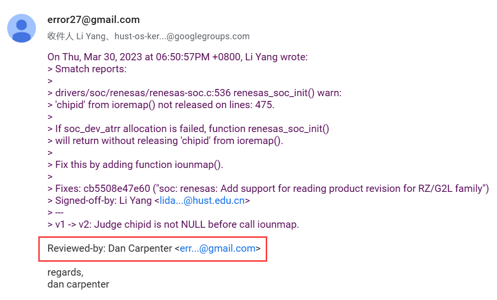

# Kernel Contribution FAQ

## 注意事项

1. 在git format-patch生成patch文件以后，使用./scripts/checkpatch.pl ${PATCH_FILE}检查patch文件时，**warning是不可忽略的**。

2. git send-email时出现的很多错误可以用**重发几次**的方法解决。

3. https://docs.kernel.org/process/submitting-patches.html

4. 可以在https://groups.google.com/g/hust-os-kernel-patches查看团队过去发送的patch。

5. **请在 gitconfig 中将 name 设置成自己的真名。**

## Issue 修复参考

### Missing unwind goto ...

参考 Dan 的 Blog：内核错误处理规范

https://staticthinking.wordpress.com/2022/04/28/free-the-last-thing-style/

### XXX is an error pointer or valid

Return from debugfs_create_dir

```
Debugfs is kind of weird.  The correct thing here is just to delete the
NULL check.

There are some times where a driver will do something weird with the
dir->inode pointer so in that case we need to check for errors.  But if
the driver doesn't dereference the dir pointer then we can just delete
the error handling.

The commit message would say:

    [PATCH] wifi: mt7601u: delete dead code checking debugfs returns

    Smatch reports that:
      drivers/net/wireless/mediatek/mt7601u/debugfs.c:130
      mt7601u_init_debugfs() warn: 'dir' is an error pointer or valid".

    Debugfs code is not supposed to need error checking so instead of
    changing this to if (IS_ERR()) the correct thing is to just delete
    the dead code.

The other question about this code is when are the debugfs files
deleted?  I don't see that happening and it seems like it would lead to
a use after free or something.

Debugfs can only be written to by root and driver unload is a privileged
operation so this is not a security issue but it would be a bug.

regards,
dan carpenter
```

## Patch 相关问题

### 我应该何时添加 Reviewed-by 标签？

- 只有当大家看见这样的回复邮件时，你才可以在下一版本的patch中加上reviewed-by tag，否则，贸然加上别人的reviewed-by tag会很不礼貌。



### Commit Title 前面的 xxx: yyy: 是什么？如何编写合适的 Commit Title？

- 可以使用git log --oneline ${FILE}查看其他人对该文件的commit标题，并仿照他们的标题。


### 我在发送第二版 Patch 时需要注意什么？

- Change log. 

  提交第二（n）版Patch时，需要在COMMIT MSG后面三个横线下面写上，最近的 change log 写在最上面，格式为：

  ```
  v2 -> v3: ...
  v1 -> v2: ...
  ```

  例子为：

- Subject prefix. 

  使用[PATCH v2]而不是[PATCH]

### 把 Patch 发送到内核邮件列表之后很长时间没有回复怎么办？

可以回复“ping？”，但不要发送 PATCH V2 或 PATCH RESEND

### 我的第一版 Patch 存在问题，如何在第一版的基础上生成第二版的 format-patch？

- 还没有git send-email出去的patch，此时你的Patch依旧是第一版，不需要添加v2之类的信息

  - 如果是对代码的修改有问题，将代码重新修改后，使用git commit --amend -asev命令重新提交commit
  - 如果是commit message有误，则直接使用git commit --amend -asev命令，修改commit message即可
  - 修改完毕后，git format-patch -1即可生成新的patch

- 已经发送出去的patch

  - 第一步和没有发送出去的patch一样，但是在format-patch的时候要指定subject git format-patch -1 --subject-prefix="PATCH v2"  

### 内核邮件列表中 PATCH 主题的 [PATCH  xx] 都是什么意思？我要怎么使用？

为了修改 patch 的前缀，可以使用 --subject-prefix 选项

```bash
git format-patch -1 --subject-prefix="PATCH v2"
```

生成多个 patch (patch set)

```bash
$ git format-patch -2 --subject-prefix="PATCH v2"
0001-clk-imx-clk-imx8mp-use-dev_-managed-memory-to-avoid-.patch
0002-clk-imx-clk-imx8mp-add-error-handling-of-of_clk_add_.patch

$ sed -n 4p ./0001-clk-imx-clk-imx8mp-use-dev_-managed-memory-to-avoid-.patch
Subject: [PATCH v2 1/2] clk: imx: clk-imx8mp: use dev_ managed memory to avoid
```

### 我对分配给我的任务感到困难，我应该向谁寻求帮助？

1. 先问自己啦，参考我们内部的邮件列表中的讨论，由于我们的 issue 大多数是由 smatch 扫描出来的，里面有很多相同类型的问题，也许你的问题就可以在邮件列表里找到答案
2. 参考历史 patch 的写法。用 git blame 看看这个文件的修改历史，或者同一文件夹下其他文件的修改历史，可能可以得到启发
3. 向 Copilot 或直接在群里提问

### 我发现我得到的任务是 False Positive，我应该怎么办？

可以把问题发到邮件列表里，或者在群里大家一起讨论

### Patch 中的 Fixes 标签是什么意思？我何时应当添加？要怎么添加？

1. Fixes: 表示这个Patch修复了一个之前commit引入的问题。这样做是为了更方便地使定位bug的起源，以帮助修复Bug。这个标签同样辅助stable内核团队确定这个patch应该打到那些版本的stable内核上。This is the preferred method for indicating a bug fixed by the patch. See Describe your changes for more details.

2. 步骤

  1. 首先，如果之前使用git checkout -b新建分支，那么在查找Fixes之前需要切换到master分支，参考命令`git switch master``

  2. 使用 `git blame {file_path}` 查看引入bug代码的commit hash，例如 `git blame drivers/clk/imx/clk-imx8mn.c` 之后定位到进入代码的行数
